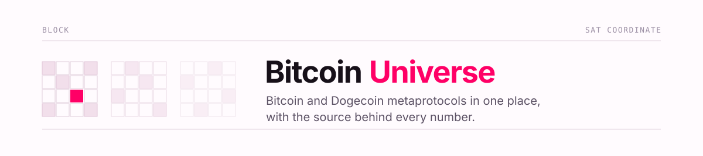
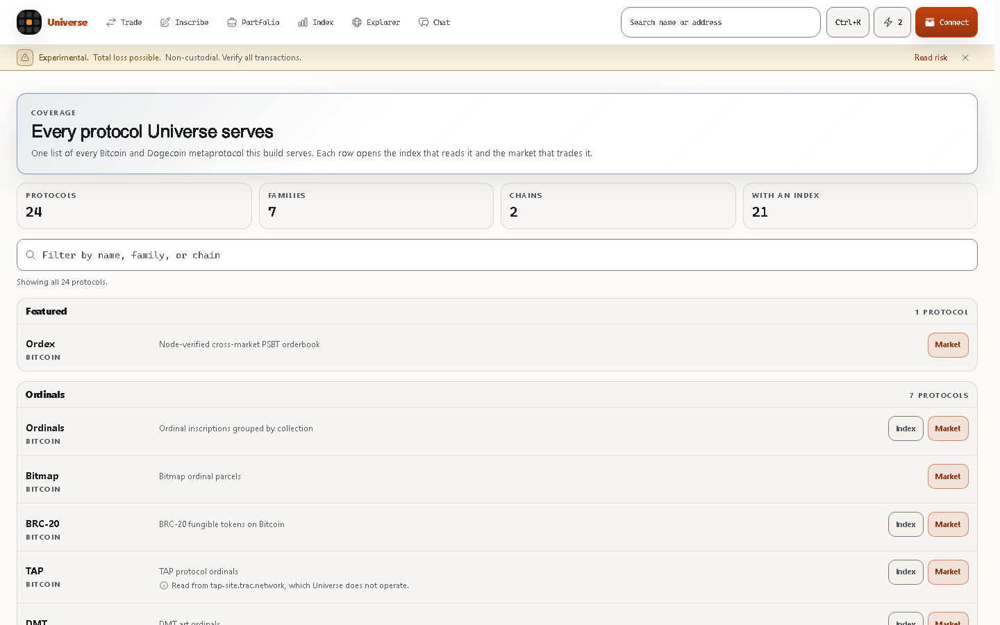
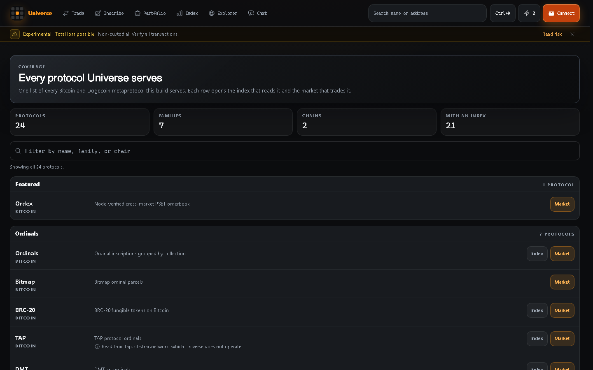
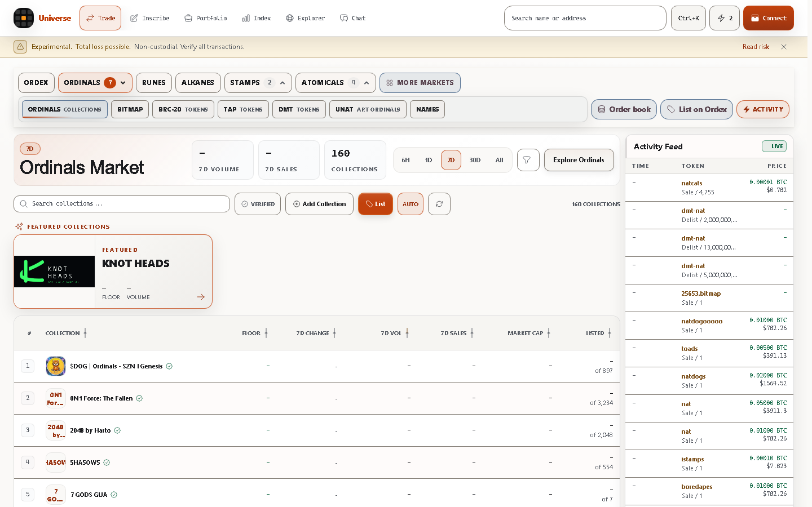
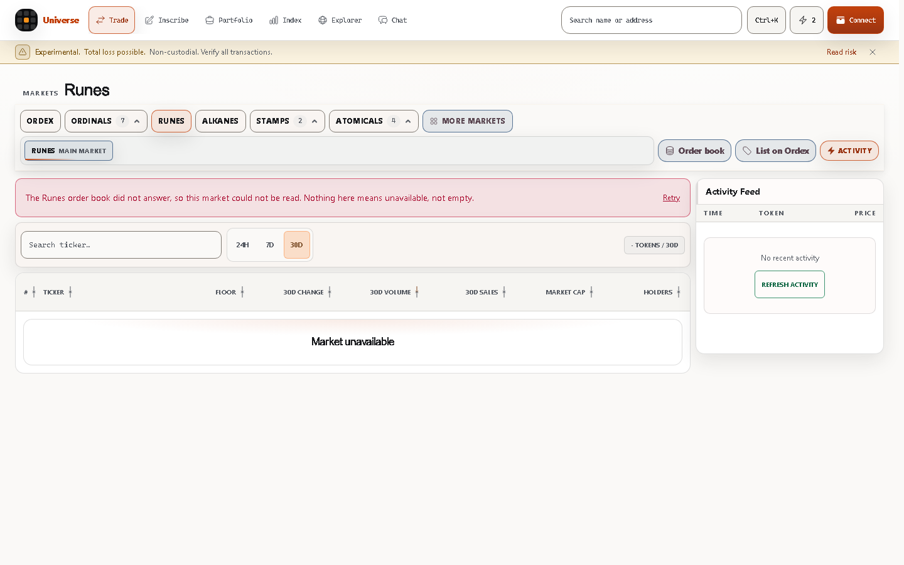
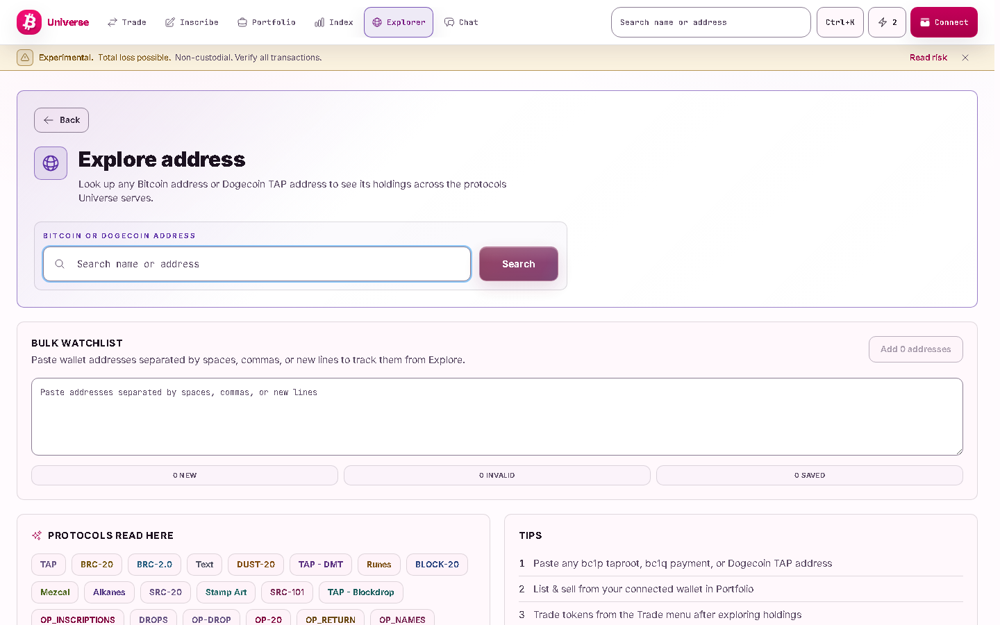
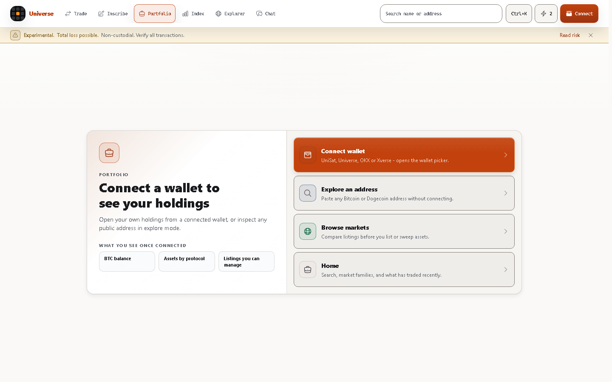
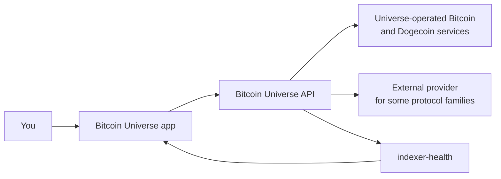
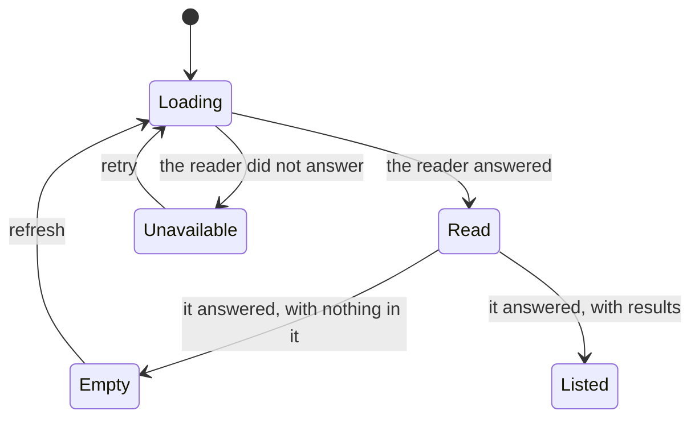

<picture>
  <source media="(prefers-color-scheme: dark)" srcset="docs/assets/banner-dark.svg">
  
</picture>

# Bitcoin Universe

One explorer and market for the Bitcoin and Dogecoin metaprotocols this
application serves. Browse markets, look up an address, inspect an asset, and
review a transaction before you sign it. Every number on screen can be traced
back to the reader it came from, and a reading that failed says so instead of
showing a zero.

**[Open the app](https://www.bitcoinuniverse.io)** ·
[Protocol coverage](https://www.bitcoinuniverse.io/coverage) ·
[Guides](#guides) ·
[Data and availability](#how-data-and-availability-work) ·
[Safety](guides/market-safety.md) ·
[Report a security issue](SECURITY.md)

Use `https://www.bitcoinuniverse.io`. The bare `bitcoinuniverse.io` address
redirects to a different Bitcoin Universe application, so a link that drops the
`www` will not open the pages described here.

## What you can do

Without connecting a wallet:

- Search a Bitcoin or Dogecoin address, a transaction, a block, an inscription,
  a sat, or a ticker, and land on the page that reads it. Search says so when
  it cannot resolve an input rather than guessing at one.
- Browse markets for each protocol family, with listings, floors, holders, and
  recent activity.
- Open a protocol's index and inspect individual assets. Not every protocol
  has a standalone index; the coverage page marks the ones that do.
- Read what the application covers, and what "covered" does and does not mean.

With a self-custody wallet connected:

- See your holdings grouped by network, protocol, and asset type.
- List, update, and delist items in the markets that support it.
- See the asset, the amount, the service fee, the network fee estimate, and
  the total before your wallet asks you to sign.
- Watch a listing or a purchase appear in the market activity feed once it is
  on chain.

## Start in under a minute

1. Open [www.bitcoinuniverse.io](https://www.bitcoinuniverse.io).
2. Paste an address, a transaction ID, or a ticker into the search box at the
   top, or press <kbd>Ctrl</kbd>+<kbd>K</kbd>. Nothing here needs a wallet.
3. Pick a market from **Trade**, or open
   [Protocol coverage](https://www.bitcoinuniverse.io/coverage) to see the full
   list and jump straight to the index or market for any row.

Connect a wallet only when you want to act. Read
[Market and wallet safety](guides/market-safety.md) first if this is your first
transaction.

## Choose your path

| You want to | Start here |
| --- | --- |
| Look around without connecting | [Product tour](#product-tour), then the live [markets](https://www.bitcoinuniverse.io/trade) |
| Understand what is covered | [Protocol coverage](guides/protocol-coverage.md) |
| Connect a wallet safely | [Market and wallet safety](guides/market-safety.md) |
| See your own assets | [Manage assets from Portfolio](guides/portfolio-market-actions.md) |
| Buy from an Ordinals collection | [Browse an Ordinals collection market](guides/ordinals-collection-market.md) |
| Trade on the Ordex order book | [The Ordex market](guides/ordex-market.md) |
| Work with Atomicals | [Atomicals markets and Portfolio](guides/atomicals-and-portfolio.md) |
| Know where a number came from | [How data and availability work](#how-data-and-availability-work) |
| List a collection you created | [Add an Ordinals collection](guides/ordinals-collection-imports.md) |
| Understand an unavailable market | [Bitcoin data reliability](guides/bitcoin-data-reliability.md) |
| Report a problem | [Open an issue](https://github.com/bitcoinuniverseio/docs-core/issues) |
| Report a security issue | [SECURITY.md](SECURITY.md) |

## Product tour

Every image below is the running product at `www.bitcoinuniverse.io`, captured
without a wallet connected.

### Protocol coverage

One page lists what this build serves, grouped by family, with the index and
the market for each row. The counts are computed from the same registry that
builds the navigation, so the number on the page is the number of protocols the
application can actually open.



The whole application ships a light and a dark theme, and the coverage page is
the same page in both.



### Markets

Each protocol family has a market with the same anatomy: a family picker, the
period the figures cover, a searchable table, and an activity feed. Figures the
reader did not return are shown as a dash, never as a zero.



When a reader cannot be reached, the market says exactly that and offers a
retry. It never presents a failed read as an empty market.



### Explore an address

Paste any Bitcoin or Dogecoin address to see its holdings across the protocols
Universe serves, with no wallet connected and nothing to sign.



### Portfolio

Portfolio opens with what connecting gives you, and offers explore mode for
anyone who would rather inspect a public address than connect.



## Networks, protocols, and actions

Bitcoin Universe serves protocol families on Bitcoin and on Dogecoin. The
authoritative list is generated by the application itself and published at
[www.bitcoinuniverse.io/coverage](https://www.bitcoinuniverse.io/coverage): it
names each protocol, its chain, its family, and whether it has an index page,
a market, or both.

Covered means this application reads the protocol and serves it here. It does
not mean that a market has listings right now, that a market has depth, that
every action is available for that protocol, or that Universe operates the
index behind every row.

[Protocol coverage](guides/protocol-coverage.md) explains how to read that
page and what each column means.

## How data and availability work



`indexer-health` names the source, chain tip, lag, and last successful read for
each protocol, and the application shows what it says rather than a summary of
it.

Two different things are often confused, so they are stated separately.

**Bitcoin and Dogecoin network data.** Chain height, blocks, transactions,
address activity, address UTXOs, and fee estimates come from Universe-operated
services. There is no public-provider fallback: if that source is unavailable,
the API answers with an explicit unavailable response rather than a zero or a
stale value. [Bitcoin data reliability](guides/bitcoin-data-reliability.md)
describes that contract in full.

**Protocol data.** Some protocol families are read through an external
provider rather than a Universe-operated index. That is stated on the coverage
page rather than hidden. The public health response at
[api.bitcoinuniverse.io/indexer-health](https://api.bitcoinuniverse.io/indexer-health)
names the source, chain tip, lag, and last successful read for each protocol
it serves, so the current answer is always one request away rather than a
sentence in a document that can age.

### What a state on screen means



- **Loading** shows a placeholder that holds the layout. A placeholder never
  contains a number.
- **Listed** shows results, with the period each figure covers.
- **Empty** means the reader answered and there is nothing listed. This is a
  fact about the market.
- **Unavailable** means the reader did not answer. This is a fact about the
  read, not about the market, and the page says so and offers a retry.
- A figure that was not returned is shown as a dash. A dash is not a zero.

## Safety and self-custody

- Your keys stay in your wallet. Bitcoin Universe never holds them and never
  moves an asset without a signature you approve in your own wallet.
- Nobody working on Bitcoin Universe will ever ask for your seed phrase or
  private key. There is no support process that needs either.
- The trade confirmation shows the asset, the amount, the service fee, the
  network fee estimate, and the total before your wallet asks you to sign, and
  says that a broadcast transaction cannot be recalled. Your wallet shows the
  transaction’s own inputs and outputs; read them there before you approve.
- Assets can live on a single satoshi. The application protects asset-bearing
  outputs from being spent as ordinary change.
- A transaction that has been broadcast cannot be recalled.

[Market and wallet safety](guides/market-safety.md) is the page to read before
your first transaction.

## Guides

**Getting started and safety**

- [Market and wallet safety](guides/market-safety.md)
- [Protocol coverage](guides/protocol-coverage.md)
- [Bitcoin data reliability](guides/bitcoin-data-reliability.md)
- [Secure blockchain data access](guides/secure-blockchain-data-access.md)

**Markets**

- [Marketplace v1 capabilities and safety gates](guides/marketplace-v1.md)
- [The Ordex market](guides/ordex-market.md)
- [Browse an Ordinals collection market](guides/ordinals-collection-market.md)
- [Atomicals markets and Portfolio](guides/atomicals-and-portfolio.md)
- [Shared collection media](guides/shared-collection-media.md)

**Owning and creating**

- [Manage assets from Portfolio](guides/portfolio-market-actions.md)
- [Add an Ordinals collection](guides/ordinals-collection-imports.md)
- [Private chat verification](guides/private-chat-verification.md)

**Speed, navigation, and releases**

- [Instant interaction and route continuity](guides/performance-and-ui-4.md)
- [Earlier performance work](guides/performance-and-ui-3.md)
- [Release validation](guides/release-validation.md)

**For platform operators**

- [Backend Operations Console](guides/backend-operations-console.md)

## Getting help

- A question about using the product: open an
  [issue](https://github.com/bitcoinuniverseio/docs-core/issues).
- A page here that does not match what the product does: open an issue and name
  the page and the screen. That mismatch is a defect in this repository.
- A suspected security issue: follow [SECURITY.md](SECURITY.md). Do not open a
  public issue for it.

## About this repository

This repository is the public documentation for Bitcoin Universe. It describes
what the product does and how to read it. The application source, its
infrastructure, and its operator procedures are kept elsewhere and are not
published here.

[CONTRIBUTING.md](CONTRIBUTING.md) covers the house rules for prose,
screenshots, and the check that runs on every change:

```bash
node scripts/check-docs.cjs
```
